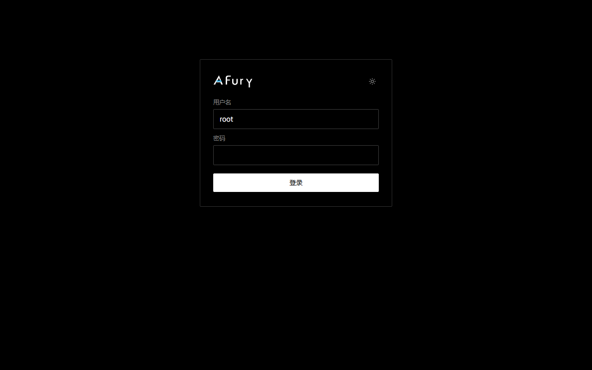
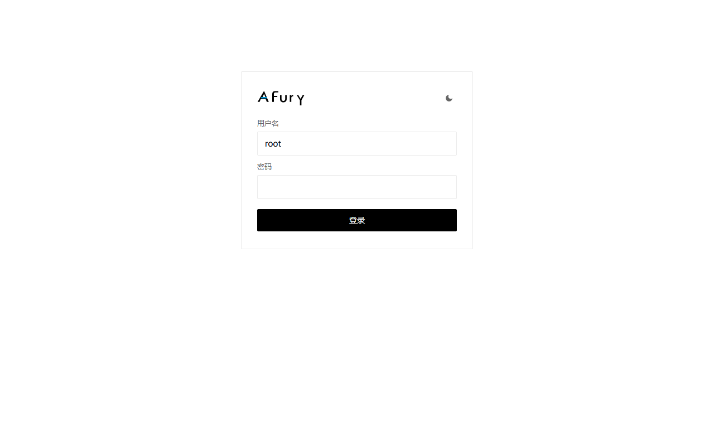
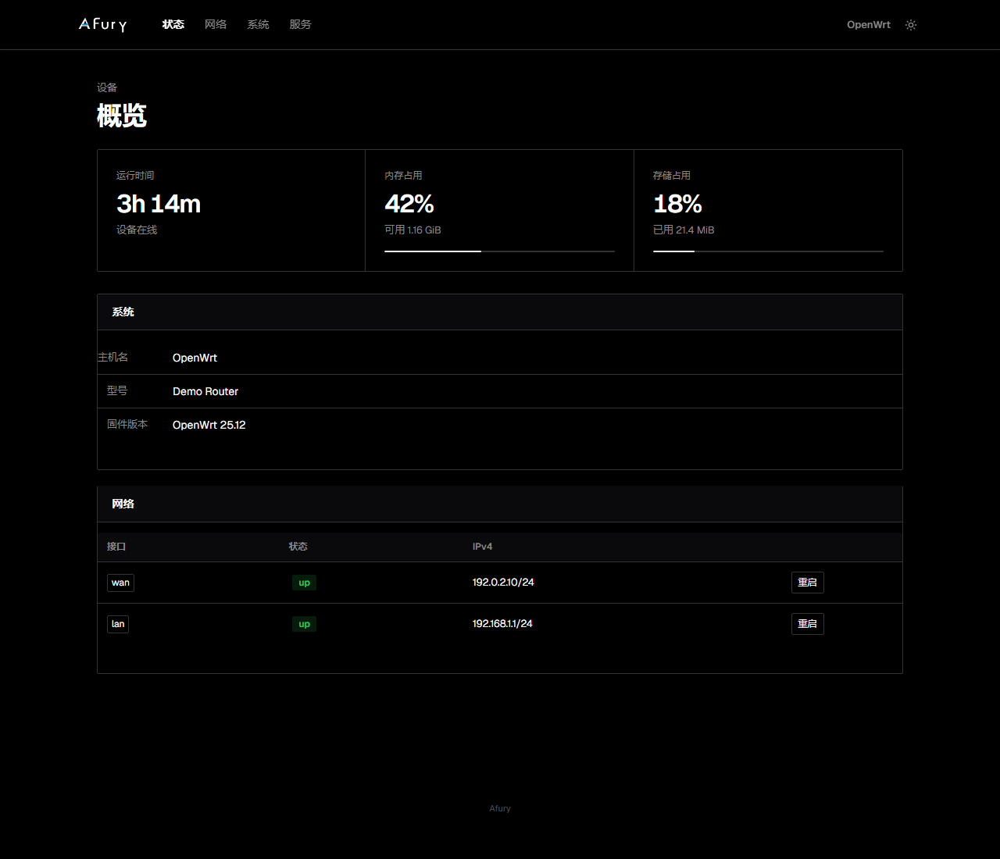
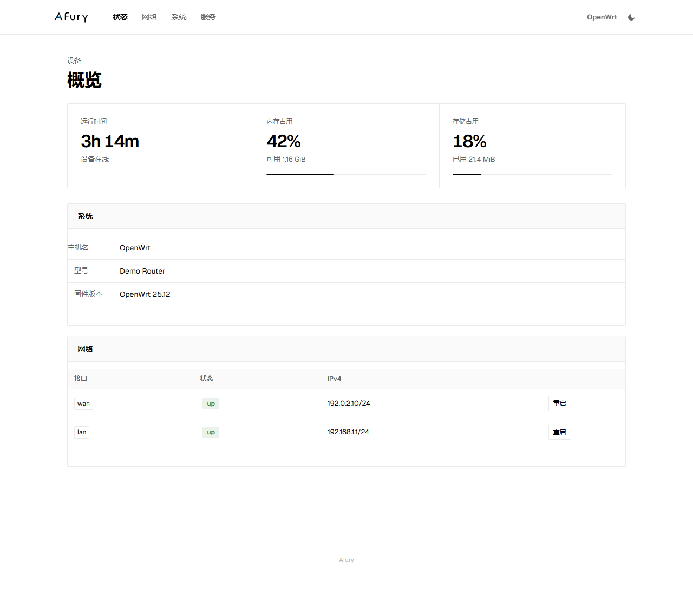
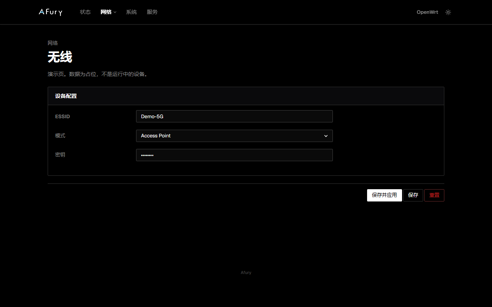

# luci-theme-afury

[中文](#中文) · [English](#english)

Afury is a LuCI theme for **OpenWrt 25.12**. White or black canvas, 1px hairlines, ink primary actions, and a cyan bar only on the wordmark.

Screenshots below are from the local `preview/` pages. They use demo copy and documentation addresses — not a live router.

---

## 中文

独立主题包。安装后静态资源在 `/luci-static/afury`，ucode 模板在 `themes/afury`。LuCI 里会列出 **Afury**、**AfuryDark**、**AfuryLight**。

### 截图

登录（深色 / 浅色）：




概览（深色 / 浅色）：




表单（深色）：



### 视觉

- 画布纯白或纯黑，卡片同色加发丝线，无阴影、无玻璃
- 顶栏是 wordmark，右侧是主机名和外观切换
- 登录页只留 wordmark，不用「需要授权」当标题
- 主按钮是墨色压画布；青色 `#0496D4` 只出现在 A 的横杠
- 中文标签保持原样，不加字距、不大写

设计说明见 [DESIGN.md](DESIGN.md)。

### 编进 OpenWrt

```sh
cp -a luci-theme-afury package/luci-theme-afury
```

`.config`：

```
CONFIG_PACKAGE_luci-theme-afury=y
# CONFIG_PACKAGE_luci-theme-argon is not set
```

装上后：

```
/www/luci-static/afury/
/www/luci-static/resources/menu-afury.js
/usr/share/ucode/luci/template/themes/afury/
/etc/uci-defaults/90_luci-theme-afury
```

`90_luci-theme-afury` 排在 bootstrap 的 `30_` 之后，会把默认主题设为 Afury。

### 本地预览

在本目录执行：

```sh
python -m http.server 8765
```

打开 `http://127.0.0.1:8765/preview/`。`?dark=1` / `?dark=0` 可强制深色或浅色。

### 许可

[Apache License 2.0](LICENSE)

---

## English

A standalone LuCI theme package. Install paths are `/luci-static/afury` and `themes/afury`. LuCI lists **Afury**, **AfuryDark**, and **AfuryLight**.

### Screenshots

Login (dark / light):


Overview (dark / light):


Form (dark):


### Look

- Canvas is white or black. Cards use the same surface plus a hairline. No elevation, no glass.
- The top bar is the wordmark. Hostname and the theme toggle sit on the right.
- The login face is the wordmark. Do not use LuCI “Authorization Required” as a title.
- Primary actions are ink on canvas. Cyan `#0496D4` is only the A crossbar.
- Chinese labels stay as-is. No letter-spacing or uppercase on CJK.

See [DESIGN.md](DESIGN.md) for tokens and rules.

### Build into OpenWrt

```sh
cp -a luci-theme-afury package/luci-theme-afury
```

`.config`:

```
CONFIG_PACKAGE_luci-theme-afury=y
# CONFIG_PACKAGE_luci-theme-argon is not set
```

After install:

```
/www/luci-static/afury/
/www/luci-static/resources/menu-afury.js
/usr/share/ucode/luci/template/themes/afury/
/etc/uci-defaults/90_luci-theme-afury
```

`90_luci-theme-afury` runs after bootstrap’s `30_` and sets Afury as the default.

### Local preview

From this directory:

```sh
python -m http.server 8765
```

Open `http://127.0.0.1:8765/preview/`. Use `?dark=1` / `?dark=0` to force a mode.

### License

[Apache License 2.0](LICENSE)
